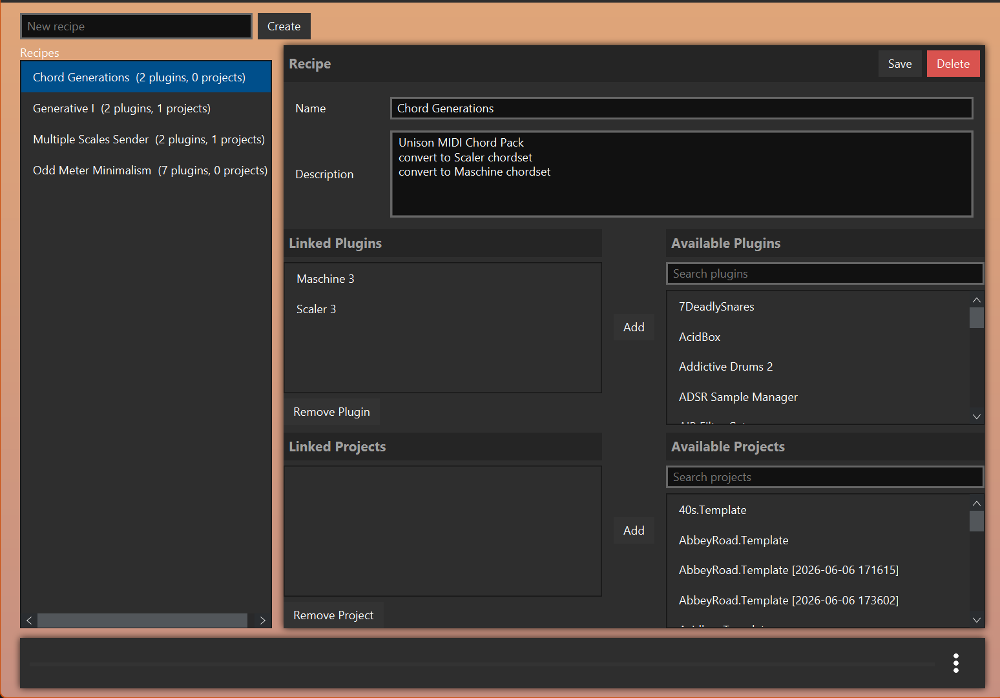

# OwlPlug-rx

OwlPlug-rx is a fork of OwlPlug focused on additional workflow features and
local Windows build/release polish.

For the original OwlPlug project overview, installation notes, general feature
documentation, and upstream development information, see the original
[README.md](https://github.com/DropSnorz/OwlPlug/blob/master/README.md).

## Added Functionality

### Recipes

OwlPlug-rx adds a **Recipes** tab for grouping plugins and DAW projects into
named collections. A recipe can contain:

- a name and free-form description
- linked plugins
- linked DAW projects

This makes it easier to keep track of plugin/project setups such as chord
generation chains, sound-design templates, or DAW-specific collections.



### Recipe Editing Fix

Recipe descriptions are preserved while adding or removing linked plugins and
projects. You can type a description, add links, and continue editing without
the description field being reset.

### OwlPlug-rx Branding

The fork uses OwlPlug-rx branding in the visible application UI, including the
window title, splash screen, About/Options text, registry labels, and Windows
installer naming.

The splash screen also identifies the project as:

> This is a fork of Owlplug, by eguilder@github

### Embedded Scanner Handling

Local Windows development builds now download the matching OwlPlug Scanner
binary into `owlplug-host/src/main/resources` before Maven packaging. The
downloaded scanner binary is ignored by Git, matching the release-artifact
style used by CI while keeping local builds convenient.

If the embedded scanner is not bundled, OwlPlug-rx treats that as an optional
loader state instead of emitting scary runtime errors.

### Windows MSI Packaging

The Windows packaging script now produces an OwlPlug-rx-named installer:

```text
OwlPlug-rx-<version>-win-x64.msi
```

The packaged application name and vendor are also set to `OwlPlug-rx`.
